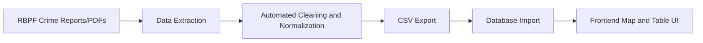

# Bahamas Crime Intelligence Map

## 📌 Project Overview
Bahamas Crime Intelligence Map is a data-driven project designed to analyze crime trends across subdivisions in The Bahamas. Using publicly available annual crime reports and statistical releases from the Royal Bahamas Police Force (RBPF), the project aims to provide clear insights into how crime patterns evolve over time and across different communities.

Currently, the platform focuses on **New Providence & Paradise Island** as the pilot region, serving as the foundation for a scalable, nationwide crime intelligence system.

The goal is to create a transparent, accessible, and decision-support tool that supports:
- **Trend analysis** of crime categories (e.g., property crime, violent crime, etc.)
- **Subdivision-level comparisons** to identify hotspots and safer areas
- **Visual mapping** of crime data using QGIS, enabling geographic exploration of trends

---

## 🔎 Objectives
- Structure and standardize RBPF crime data into machine-readable datasets.
- Analyze year-over-year changes in crime categories.
- Highlight subdivision-specific crime trends.
- Provide visual dashboards for analysts, policymakers, law enforcement stakeholders, and community leaders.
- Integrate QGIS shapefiles to display subdivision-level crime trends on an interactive map.
- Build a scalable foundation for national crime intelligence and future AI integration.

---

## 🗂️ Data Sources
- Royal Bahamas Police Force Annual Crime Reports (2019–2024)
- Official RBPF statistical releases
- Subdivision boundary GeoJSON/shapefiles (for QGIS integration)

### 🗺️Geospatial Data Engineering
- Custom geospatial data was developed to enable subdivision-level mapping and analysis.
- Created a custom GeoJSON file of New Providence and Paradise Island subdivisions, derived from official public boundary data (posted by myself as a separate project).
- Standardized subdivision codes and names to align with RBPF crime datasets.
- Prepared and validated geometry for use in interactive web mapping (Leaflet).

### ⚙️ Data Engineering & Automation
- Extracted raw RBPF crime data from official reports.
- Built an automated pipeline to clean, normalize, and structure datasets.
- Converted processed data into CSV files and imported into a database for easy scalability and updating.
- Ensured consistent subdivision codes and offence categories for reliable filtering and analysis.
- Designed the workflow to support future expansion and integration with national datasets.

### 🔄 Data Processing Workflow

---

## 🛠️ Tools & Technologies
### Languages & Core Stack
- **HTML** for primary structure for frontend overlays and map interface
- **Python** for data cleaning, statistical analysis, backend logic
- **JavaScript** for dynamic UI interactions and React components
- **CSS** for responsive styling and theme toggles
- **Dockerfile** for containerization for consistent deployment environments
- **SQL** for database integration for structured crime datasets

### Backend
- **Python** for data cleaning and analysis
- **Pandas / NumPy** for statistical and data processing
- **FastAPI** for connecting backend coding to the frontend

### Frontend
- **React.js** for user interface
- **React Leaflet** for interactive geospatial mapping

### Data Visualization 
- **Matplotlib / Seaborn / Plotly** for visualizations (initial prototypes)
- **Lealfet-based choropleth mapping** for visualizations (current implementation)
- **QGIS** for spatial mapping of subdivision-level crime trends

### Development Workflow and Tools
- **Virtual Studio Code** for development
- **Docker** for consistent containerization
- **Microsoft's Copilot and OpenAI's ChatGPT** for code suggestions, problem-solving, debugging, and architectural guidance
- **Git & GitHub** for version control and collaboration

---

## 📂 Project Structure
- `frontend/` – React UI and Leaflet map
- `backend/` – FastAPI services and data pipeline
- `data/` – Cleaned CSV datasets
- `geojson/` – Subdivision boundary files

---

## 🌍 Current Features (Phase 1: New Providence and Paradise Island)
1. **Interactive Crime Heatmap** displayed by police subdivisions.
2. **Dynamic Filtering** which filters by Year, Division and/or Offence Type.
3. **Hover-Based subdivision insights** displays information for a division by simply hovering over it.
4. **Click-to-filter Comparison Table** allowing users to filter divisions quickly by clicking them.
5. **Responsive design** coded for both mobile and desktop devices.
6. **Dark/Light Map Themes** granting users two map themes. 

---

## 🚀 Future Roadmap
### Phase 2 – Expansion
- Extend coverage to Grand Bahama and Family Islands
- Improve dataset completeness and historical depth

### Phase 3 – Intelligence Layer
- Predictive crime modeling (machine learning)
- Time-series forecasting of crime trends
- Risk scoring for each division

### Phase 4 – Decision Support System
- Policy simulation tools
- Resource allocation insights for law enforcement
- Public-facing dashboards for transparency

---

## 📖 Description
Bahamas Crime Intelligence Map is more than just a visualization tool—it is **a prototype of a national crime intelligence system for The Bahamas**. By combining statistical analysis with geographic visualization, the project will help communities, policymakers, and researchers understand where crime is concentrated and how it changes over time. The integration with QGIS will allow subdivision-level mapping, making trends visible in a way that raw tables and charts cannot. This approach transforms static reports into actionable intelligence, supporting smarter decision-making and long-term national development.

---

## 🤝 Feedback & Iteration
This project was refined through continuous feedback from peers, family, and early users, helping improve:
- User interface and usability
- Feature prioritization
- Overall user experience across devices

---

## 🌐 Live Demo & Deployment
You can explore the Bahamas Crime Intelligence Map directly through the following hosted services:

- **Frontend (React, Vercel)**: https://bahamas-crime-intelligence-map.vercel.app  
→ This is the interactive web application where you can filter crime data, view subdivision heatmaps, and explore trends.

- **Backend (FastAPI, Render)**: https://bahamas-crime-intelligence-map.onrender.com  
→ This is the API service powering the frontend. It provides endpoints for filters, map data, and table data. You can also explore the interactive API documentation at /docs.

### 🔗 Available API Endpoints
- `/filters` → Retrieve available years, divisions, and offence categories

- `/map-data` → Aggregated crime counts for map visualization

- `/table-data` → Detailed subdivision-level crime statistics

### ⚠️ Note on Backend Hosting (Render Free Tier)  
The backend is hosted on Render’s free plan. This means:

- The service “spins down” after periods of inactivity.

- The first request after inactivity may take 30–60 seconds to wake up.

- Subsequent requests will be fast once the service is active.

---

## 🤝 Contributions
Contributions are welcome! Assistance in obtaining boundaries and subdivisions for Grand Bahama and other family islands would be greatly appreciated; as we move into the next phase.

---

### 🚀 Getting Started (Development)
If you’d like to run the project locally or contribute:
1. Clone the repository
2. Install frontend dependencies (`npm install`)
3. Start the React development server (`npm start`)
4. Install backend dependencies (`pip install -r requirements.txt`)
5. Run FastAPI (`uvicorn api:app --reload`)

---

## 📜 License
This project is licensed under the MIT License. See the LICENSE file for details.
